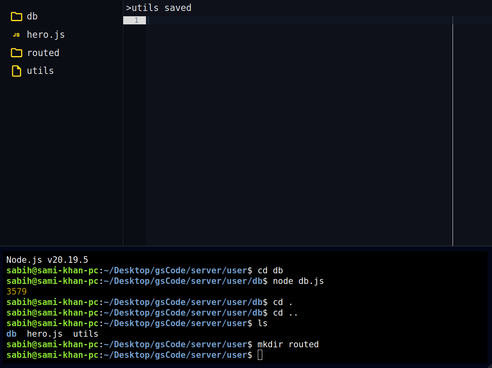
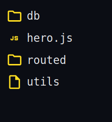
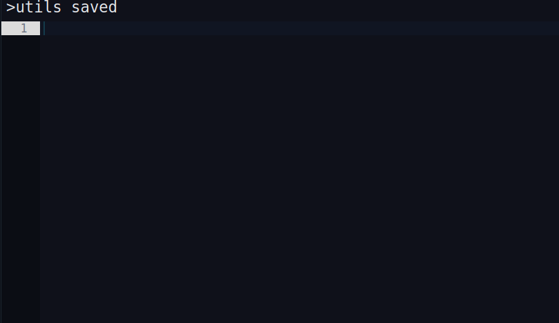
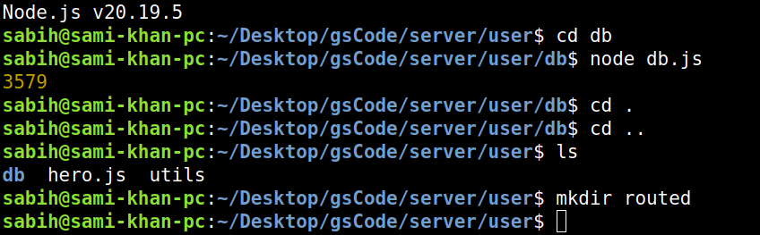

# 🚀 GoldenStudio Code - CodeEditor Web

 

### A Browser-Based Development Environment Inspired by Replit

**GoldenStudio Code: CodeEditor Web** is a modern, scalable **online code editor and execution platform** that enables users to **write, edit, and run code directly in the browser**, complete with a real-time terminal and project file system.

This project demonstrates strong **full-stack engineering skills**, real-time systems, and production-oriented architecture—designed with extensibility and cloud deployment in mind.

---

## 🎯 Problem Statement

Traditional local development environments require:

- System setup & dependencies  
- Platform-specific tooling  
- Manual configuration for beginners and teams  

**CodeEditor Web** removes these barriers by offering:

- Instant coding access  
- Zero local setup  
- A unified browser-based development workflow  

---

## 💡 Solution Overview

CodeEditor Web provides a **lightweight cloud IDE** that allows users to:

- Edit code in real time  
- Execute commands via a live terminal  
- Navigate projects using a folder tree  
- Interact with a backend runtime securely  

All within a **clean, fast, and responsive web interface**.

---

## ✨ Core Features

- 🧑‍💻 **In-Browser Code Editing**  
  Write and modify code without local installations.

- 🖥️ **Real-Time Terminal (WebSocket Powered)**  
  Execute shell commands with live output streaming.

- 📂 **Project Folder Tree**  
  Structured file & directory visualization.

- ▶️ **Command Execution Engine**  
  Run, test, and debug code instantly.

- 🌐 **Client–Server Separation**  
  Scalable architecture following industry best practices.

- ⚡ **High Performance UI**  
  Optimized for speed, clarity, and usability.

---

## 📸 Screenshots

Main Screens:


Additional Screens:





---

## 🏗️ System Architecture

GoldenStudio Code is built using a **modern full-stack architecture**:

- **Frontend:** React, AceEditor, Tailwind / custom CSS  
- **Backend:** Node.js, Express, WebSockets (Socket.io)  
- **Terminal:** PTY.js for live shell execution  
- **File System:** Dynamic folder structure management  
- **Realtime Updates:** Chokidar for file watching  

---

## 🐳 Docker Setup

You can run the entire platform **locally using Docker Compose**:

```yaml
version: "3.9"

services:
  backend:
    build: ./server
    container_name: gs-backend
    ports:
      - "9000:9000"
    volumes:
      - ./server:/app
    environment:
      - NODE_ENV=development

  frontend:
    build: ./client
    container_name: gs-frontend
    ports:
      - "5173:5173"
    volumes:
      - ./client:/app
    depends_on:
      - backend
    environment:
      - VITE_API_URL=http://localhost:9000
      - CHOKIDAR_USEPOLLING=true
    command: npm run dev -- --host 0.0.0.0


Steps to Run:

Clone the repository:

git clone https://github.com/yourusername/CodeEditorWeb.git
cd CodeEditorWeb


Make sure Docker and Docker Compose are installed.

Build and start containers:

docker-compose up --build


Open your browser:

Frontend: http://localhost:5173

Backend API: http://localhost:9000

⚡ Quick Start

Click on a file in the folder tree to edit.

Modify code and see real-time updates.

Terminal executes shell commands live.

All changes are automatically saved and reflected for other users.

💛 GoldenStudio Branding

GoldenStudio Code is designed with professional UI/UX in mind:

Golden-yellow highlights for active components

Clean, dark editor theme for long coding sessions

Smooth transitions and responsive layout

🔧 Tech Stack

Frontend: React, AceEditor, Tailwind CSS / custom styles

Backend: Node.js, Express, Socket.io

Terminal: PTY.js, xterm.js

Database / Storage: Local JSON or MongoDB

Deployment: Docker, Docker Compose

Made with ❤️ by GoldenStudio